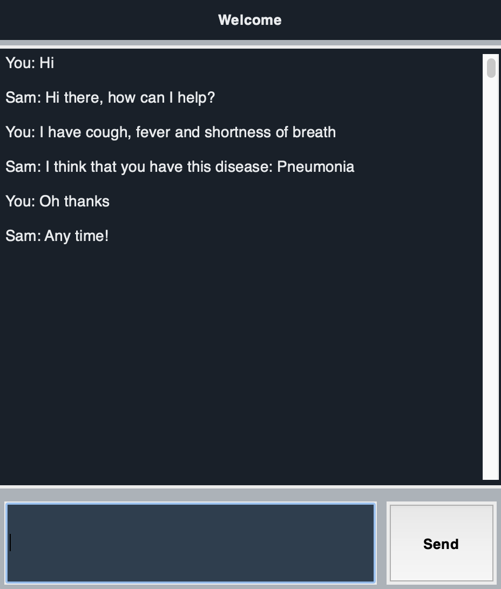
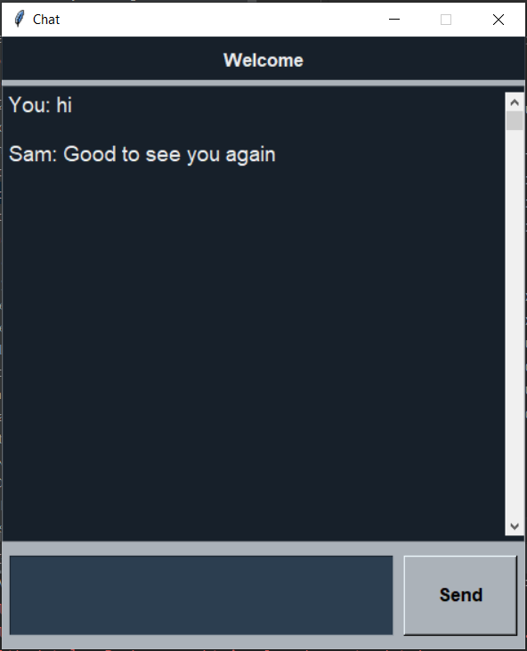
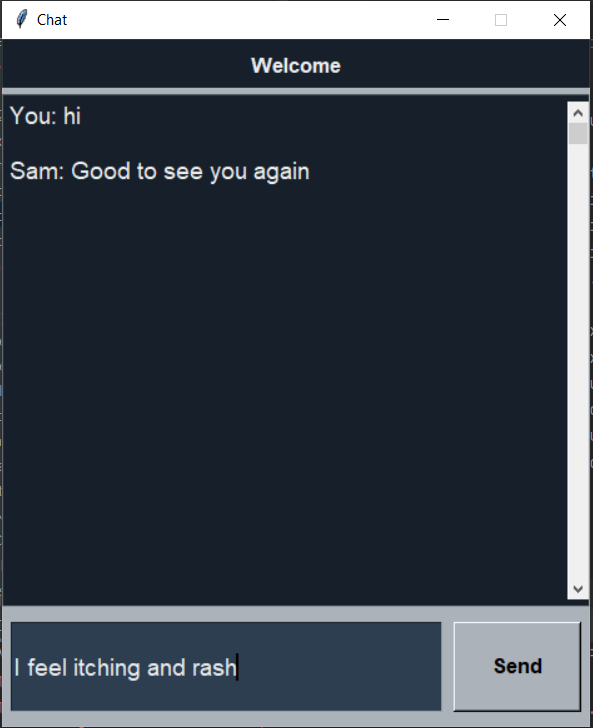
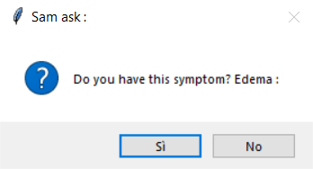
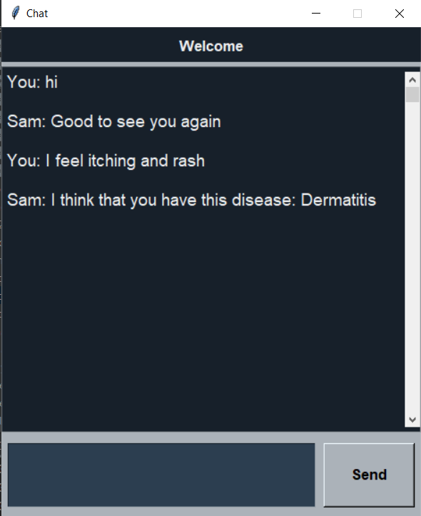

# README

# Medical Diagnosis Dialogue

This is a bot based on a reinforcement learning algorithm that interacts with a user to predict a disease starting from input symptoms.



### Dependencies

Dependency for baseline a2c algorithm

```python
pip install tianshou==0.3.0
```

Dependency for GUI Tkinter

```python
pip install tk
```

Dependency for NLP module

```python
pip install nltk
```

Eventually, other dependencies may be:

- PyTorch
- pickle

### Starting the program

Run “BotGUI.py”

Note: if you use PyCharm as IDE, create a configuration for this python file in order to execute it

Example: say to the bot that you have itching and rash (2 symptoms related to dermatitis), or try to say that you have cough, fever and shortness of breath (3 symptoms related to pneumonia)





### General info

The model can recognize 12 diseases and they are the following:

- Esophagitis
- Enteritis
- Asthma
- Coronary heart disease
- Pneumonia
- Rhinitis
- Thyroiditis
- Traumatic brain injury
- Dermatitis
- External otitis
- Conjunctivitis
- Mastitis

The model can accept 118 symptoms, you can check them in the file: “symptoms.txt” 

After you insert the initial symptoms the bot will ask you other symptoms (at least 7) until he predicts the disease. In the figure below there is an example of a request of a symptom from the bot




